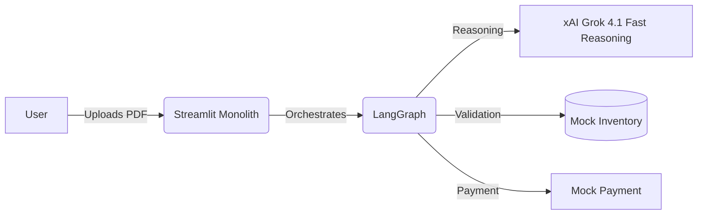

# Demo Script for Galatiq Invoice Processing Agent

## 1. System Architecture
**Pattern:** Monolithic Agent (Streamlit + LangGraph)
**Components:**
*   **Frontend (Streamlit):** User Interface for uploading invoices, viewing real-time progress, and hosting the Agentic Logic.
*   **Engine:** LangGraph + Grok-3 (embedded in Streamlit app).
*   **Database:** SQLite (Mock Inventory) + In-Memory Session State.

## 2. Deployment
**Google Cloud Run (Production Mode):**
*   **Service:** `https://galatiq-invoice-agent-2lshkth7qq-uc.a.run.app` (Monolithic Container)

**Local Execution (Spec Compliant):**
*   Run `python3 main.py --invoice_path <file>` for a CLI-only experience.
*   Run `streamlit run streamlit_app.py` for the UI.

## 3. Demo Scenarios

### Demo 1: Valid Low-Value Invoice (The Happy Path)
*   **Input:** `data/invoice_valid_low.txt`
*   **Expected:** Extracts data -> Validates Stock -> Auto-Approves (<$10k) -> Mocks Payment.
*   **Result:** `APPROVED` & `Paid`.

### Demo 2: High-Value Suspicious Invoice (The VP Persona)
*   **Input:** `data/invoice_high_suspicious.txt`
*   **Scenario:** Amount $15,000 (> $10k rule). Vendor "Unknown LLC". Future Date.
*   **Expected:** Ingestion OK -> Validation OK (if item exists) -> **Approval Agent Rejects**.
*   **VP Logic:** "Suspicious vendor, round numbers, bad date." -> **REJECTED**.

### Demo 3: Inventory Mismatch (Self-Correction/Failure)
*   **Input:** `data/invoice_invalid_stock.txt` (or `xfinity_bill.pdf` for real-world test)
*   **Scenario:** Requesting items not in DB (e.g., "ThingZ" or random PDF items).
*   **Expected:** Ingestion OK -> Validation **FAILS** (Item not found).
*   **Result:** **REJECTED** with specific error list.

## 4. Observability
*   All runs are logged to `run_logs.json` in structured JSON format.
*   The Streamlit UI parses these logs to show a step-by-step agent trace.

